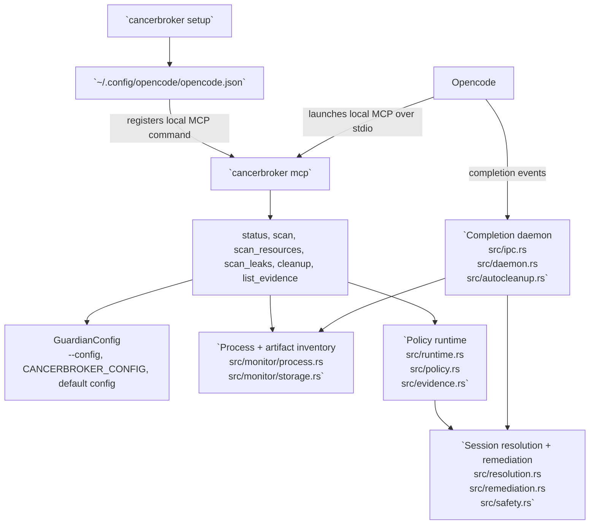

# CancerBroker

[Language Index](readme-pages/index.md) | [English](readme-pages/english.md) | [中文](readme-pages/chinese.md) | [Español](readme-pages/spanish.md) | [한국어](readme-pages/korean.md) | [日本語](readme-pages/japanese.md)

CancerBroker is a Rust cleanup tool for Opencode processes. It tracks PID, PGID, listening ports, and detailed open resources, detects repeated RSS growth, and cleans up task-scoped processes with safety checks before sending signals.

## Installation

```bash
cargo install --git https://github.com/Topabaem05/CancerBroker.git
```

## Opencode Setup

```bash
cancerbroker setup
```

This now opens a minimal line-based setup wizard on TTY and then:

- registers CancerBroker as a local Opencode MCP server using `cancerbroker mcp`
- writes rust-analyzer memory-guard settings into `~/.config/cancerbroker/config.toml`

Use non-interactive mode when you want the machine-recommended defaults without prompts:

```bash
cancerbroker setup --non-interactive
```

### Interactive Setup Example

Example command:

```bash
cancerbroker setup
```

Example prompt flow:

```text
CancerBroker setup will:
- register the local MCP server in OpenCode
- configure the rust-analyzer memory guard for this machine
Detected system RAM: 36 GB. Press Enter to accept the default shown in brackets.

Enable rust-analyzer memory protection? [Y/n]
  When enabled, CancerBroker watches rust-analyzer memory and can clean it up after repeated over-limit samples.
> 

Memory cap in GB [6]
  CancerBroker starts counting rust-analyzer as over the limit after it stays above this amount of RAM.
> 

Consecutive over-limit samples before action [3]
  This avoids reacting to a single short memory spike.
> 

Startup grace in seconds [300]
  rust-analyzer often spikes during initial indexing, so counting starts after this delay.
> 

Cooldown after remediation in seconds [1800]
  This prevents repeated remediation loops after rust-analyzer restarts.
> 
```

Notes:

- Press `Enter` on any prompt to accept the default and continue.
- Memory input is entered in whole-number `GB`, but stored internally as bytes in the guardian config.
- Existing guardian settings are reused as the next wizard defaults when you run setup again.
- The setup wizard does not change global `mode`; if your guardian config is still `observe`, the rust-analyzer guard records candidates but does not terminate processes.

## How It Works in Opencode



- `cancerbroker setup` updates `~/.config/opencode/opencode.json` so Opencode can start `cancerbroker mcp` as a local MCP server.
- `cancerbroker mcp` serves the MCP tools from `src/mcp.rs`; `status`, `scan`, `scan_resources`, `scan_leaks`, `cleanup`, and `list_evidence` are the Opencode-facing entrypoints.
- `cleanup` and `run-once` share the same policy path: `src/cli.rs` -> `src/runtime.rs` -> `src/policy.rs` -> `src/evidence.rs`.
- `daemon` is the long-running cleanup path: `src/cli.rs` -> `src/daemon.rs` -> `src/ipc.rs` -> `src/autocleanup.rs` -> `src/resolution.rs` / `src/remediation.rs`.
- Process and artifact cleanup stay scoped to Opencode/OpenAgent workloads through `required_command_markers` and same-UID safety checks in `src/config.rs` and `src/safety.rs`.

## Quick Start

```bash
cancerbroker --config fixtures/config/observe-only.toml status --json
cancerbroker --config fixtures/config/observe-only.toml run-once --json
cancerbroker --config fixtures/config/completion-cleanup.toml daemon --json --max-events 128
cancerbroker --config fixtures/config/rust-analyzer-guard-minimal.toml ra-guard --json
scripts/measure_ra_guard_rss.sh --mode baseline-idle --output /tmp/ra-guard-rss-baseline.txt
```

## What It Does

- Tracks live process identity with PID, parent PID, PGID, UID, memory, CPU, and listening ports.
- Resolves Opencode-related processes and session artifacts with command-marker safety rules.
- Captures detailed open files and socket endpoints before cleanup.
- Detects live RSS leak candidates and enforces cleanup in daemon mode.
- Terminates targets with `SIGTERM` first, then escalates to `SIGKILL` if they ignore the timeout.

## Verification

```bash
cargo fmt --all -- --check
cargo clippy --workspace --all-targets --all-features -- -D warnings
cargo test --workspace
cargo build --workspace
```

## Sandbox Termination Proof

Focused test for the leak-enforcement PID kill path:

```bash
cargo test --workspace run_leak_enforcement_with_inventory_terminates_leaking_process_in_enforce_mode -- --nocapture
```

Expected signal outcomes from sandbox verification:

```json
{"returncode": -15, "signal": 15}
{"returncode": -9, "signal": 9}
```

- `signal: 15` means the target exited after `SIGTERM`.
- `signal: 9` means the target ignored `SIGTERM` and CancerBroker escalated to `SIGKILL`.
