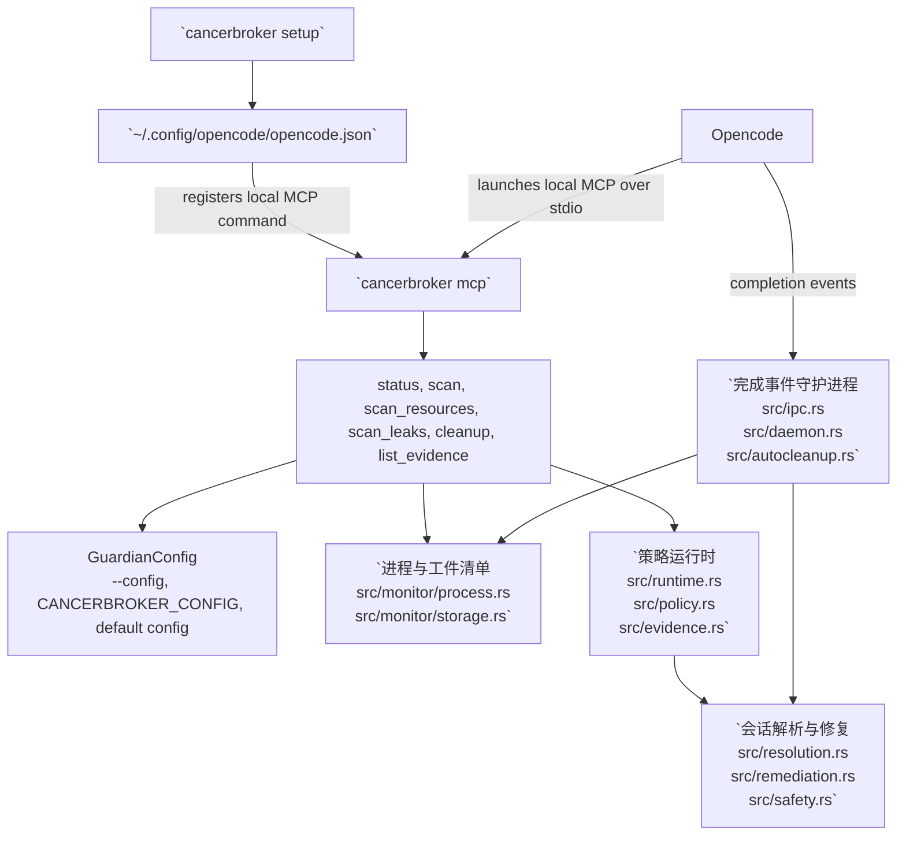

# 中文

- [返回首页](../README.md)
- [语言索引](index.md)

语言: [English](english.md) | [中文](chinese.md) | [Español](spanish.md) | [한국어](korean.md) | [日本語](japanese.md)

CancerBroker 是一个面向 Opencode 进程的 Rust 清理工具。它会跟踪 PID、PGID、监听端口和详细的打开资源，检测重复的 RSS 增长，并在发送信号前通过安全检查来清理任务范围内的进程。

## 安装

从 GitHub 安装：

```bash
cargo install --git https://github.com/Topabaem05/CancerBroker.git
```

或者直接从当前 checkout 构建安装：

```bash
cargo install --path .
```

确认二进制已可用：

```bash
cancerbroker --help
```

## Opencode 设置

```bash
cancerbroker setup
```

该命令现在会在 TTY 中打开一个交互式终端设置向导，然后：

- 使用 `cancerbroker mcp` 将 CancerBroker 注册为本地 Opencode MCP 服务器
- 将 rust-analyzer 内存保护设置写入 `~/.config/cancerbroker/config.toml`
- 如果终端 UI 初始化失败，则回退到逐行向导

如果你想直接使用当前机器推荐的默认值而不进行交互，可使用非交互模式：

```bash
cancerbroker setup --non-interactive
```

### setup 会写入什么

`cancerbroker setup` 会更新这些文件：

- Opencode MCP 配置：`~/.config/opencode/opencode.json`
- CancerBroker guard 配置：`~/.config/cancerbroker/config.toml`

如果你想覆盖 guard 配置路径，请在运行命令前设置 `CANCERBROKER_CONFIG`：

```bash
export CANCERBROKER_CONFIG="$HOME/.config/cancerbroker/custom-config.toml"
cancerbroker setup --non-interactive
```

setup 命令会打印它实际修改的路径，以及创建的备份路径。

### 手动配置流程

如果你不想使用交互式向导，最小手动流程如下：

1. 安装二进制
2. 运行 `cancerbroker setup --non-interactive`
3. 检查 `~/.config/opencode/opencode.json`
4. 检查 `~/.config/cancerbroker/config.toml`
5. 通过 `cancerbroker --config ~/.config/cancerbroker/config.toml status --json` 验证

如果你想再次移除 Opencode MCP 条目：

```bash
cancerbroker setup --uninstall --non-interactive
```

### 交互式设置示例

示例命令：

```bash
cancerbroker setup
```

代表性的向导流程：

```text
Header box: 检测到的 RAM、当前步骤、setup 目标
Step box: 标题、说明、输入区、帮助/校验面板
Summary box: enabled 状态、memory cap、样本次数、startup grace、cooldown
Controls box: Enter 确认，Up 返回，Left/Right/Space 切换 enabled，数字键和 Backspace 编辑数值，Esc 取消
Too-small box: 终端过小时显示 resize 提示
```

说明：

- 在任意提示处按 `Enter` 会接受默认值并继续。
- 内存输入使用整数 `GB`，但在 guardian 配置中会以字节形式保存。
- 如果再次运行 setup，现有 guardian 设置会作为新的默认值复用。
- 设置向导不会修改全局 `mode`；如果 guardian 配置仍然是 `observe`，rust-analyzer 内存保护只会记录候选项，不会终止进程。

## 在 Opencode 中如何工作



- `cancerbroker setup` 会更新 `~/.config/opencode/opencode.json`，使 Opencode 可以把 `cancerbroker mcp` 作为本地 MCP 服务器启动。
- `cancerbroker mcp` 从 `src/mcp.rs` 提供 MCP 工具；`status`、`scan`、`scan_resources`、`scan_leaks`、`cleanup` 和 `list_evidence` 是面向 Opencode 的入口。
- `cleanup` 和 `run-once` 共享同一条策略执行路径：`src/cli.rs` -> `src/runtime.rs` -> `src/policy.rs` -> `src/evidence.rs`。
- `daemon` 是长期运行的清理路径：`src/cli.rs` -> `src/daemon.rs` -> `src/ipc.rs` -> `src/autocleanup.rs` -> `src/resolution.rs` / `src/remediation.rs`。
- 通过 `src/config.rs` 和 `src/safety.rs` 中的 `required_command_markers` 与同 UID 安全检查，进程和工件清理会被限制在 Opencode/OpenAgent 工作负载范围内。

## 快速开始

```bash
cancerbroker --config fixtures/config/observe-only.toml status --json
cancerbroker --config fixtures/config/observe-only.toml run-once --json
cancerbroker --config fixtures/config/completion-cleanup.toml daemon --json --max-events 128
cancerbroker --config fixtures/config/rust-analyzer-guard-minimal.toml ra-guard --json
scripts/measure_ra_guard_rss.sh --mode baseline-idle --output /tmp/ra-guard-rss-baseline.txt
```

对于本地安装，常见的验证路径是：

```bash
cancerbroker setup --non-interactive
cancerbroker --config ~/.config/cancerbroker/config.toml status --json
cancerbroker --config ~/.config/cancerbroker/config.toml ra-guard --json
```

## 功能说明

- 跟踪实时进程身份信息，包括 PID、父 PID、PGID、UID、内存、CPU 和监听端口。
- 通过命令标记安全规则解析与 Opencode 相关的进程和会话工件。
- 在清理前捕获详细的打开文件和套接字端点信息。
- 检测实时 RSS 泄漏候选项，并在 daemon 模式下执行清理。
- 先用 `SIGTERM` 终止目标；如果目标在超时后仍未退出，则升级到 `SIGKILL`。

## 验证

```bash
cargo fmt --all -- --check
cargo clippy --workspace --all-targets --all-features -- -D warnings
cargo test --workspace
cargo build --workspace
```

## 沙盒终止验证

用于验证 leak-enforcement PID 终止路径的专用测试：

```bash
cargo test --workspace run_leak_enforcement_with_inventory_terminates_leaking_process_in_enforce_mode -- --nocapture
```

沙盒验证中的预期信号结果：

```json
{"returncode": -15, "signal": 15}
{"returncode": -9, "signal": 9}
```

- `signal: 15` 表示目标在 `SIGTERM` 后退出。
- `signal: 9` 表示目标忽略了 `SIGTERM`，CancerBroker 随后升级为 `SIGKILL`。
