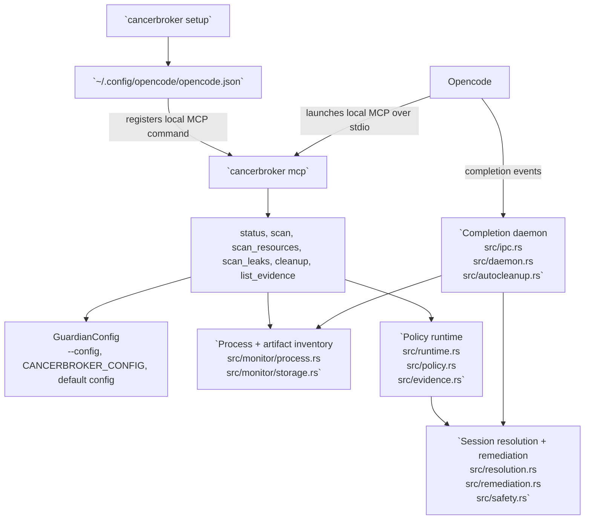

# English

- [Back to Home](../README.md)
- [Language Index](index.md)

Languages: [English](english.md) | [中文](chinese.md) | [Español](spanish.md) | [한국어](korean.md) | [日本語](japanese.md)

CancerBroker is a Rust cleanup tool for Opencode processes. It tracks PID, PGID, listening ports, and detailed open resources, detects repeated RSS growth, and cleans up task-scoped processes with safety checks before sending signals.

## Installation

Install from GitHub:

```bash
cargo install --git https://github.com/Topabaem05/CancerBroker.git
```

Build from the current checkout instead:

```bash
cargo install --path .
```

Confirm the binary is available:

```bash
cancerbroker --help
```

## Opencode Setup

```bash
cancerbroker setup
```

This now opens an interactive terminal setup wizard on TTY and then:

- registers CancerBroker as a local Opencode MCP server using `cancerbroker mcp`
- writes rust-analyzer memory-guard settings into `~/.config/cancerbroker/config.toml`
- falls back to the line-based wizard if terminal UI initialization fails

Use non-interactive mode when you want the machine-recommended defaults without prompts:

```bash
cancerbroker setup --non-interactive
```

### What Setup Writes

`cancerbroker setup` updates these files:

- Opencode MCP config: `~/.config/opencode/opencode.json`
- CancerBroker guard config: `~/.config/cancerbroker/config.toml`

If you want to override the guard-config location, set `CANCERBROKER_CONFIG` before running the command:

```bash
export CANCERBROKER_CONFIG="$HOME/.config/cancerbroker/custom-config.toml"
cancerbroker setup --non-interactive
```

The setup command prints the exact paths it touched, plus any backup paths it created.

### Manual Configuration Flow

If you do not want the interactive wizard, the minimal manual flow is:

1. install the binary
2. run `cancerbroker setup --non-interactive`
3. inspect `~/.config/opencode/opencode.json`
4. inspect `~/.config/cancerbroker/config.toml`
5. verify with `cancerbroker --config ~/.config/cancerbroker/config.toml status --json`

To remove the Opencode MCP entry again:

```bash
cancerbroker setup --uninstall --non-interactive
```

### Interactive Setup Example

Example command:

```bash
cancerbroker setup
```

Representative wizard flow:

```text
Header box: detected RAM, current step, setup targets
Step box: title, description, input, help/validation panels
Summary box: enabled flag, memory cap, sample count, startup grace, cooldown
Controls box: Enter confirms, Up goes back, Left/Right/Space toggle enablement, digits and Backspace edit numeric fields, Esc cancels
Too-small box: resize warning when the terminal is too small for the full wizard
```

Notes:

- Press `Enter` on any prompt to accept the default and continue.
- Memory input is entered in whole-number `GB`, but stored internally as bytes in the guardian config.
- Existing guardian settings are reused as the next wizard defaults when you run setup again.
- The setup wizard does not change global `mode`; if your guardian config is still `observe`, the rust-analyzer guard records candidates but does not terminate processes.

## How It Works in Opencode



- `cancerbroker setup` updates `~/.config/opencode/opencode.json` so Opencode can start `cancerbroker mcp` as a local MCP server.
- `cancerbroker mcp` serves the MCP tools from `src/mcp.rs`; `status`, `scan`, `scan_resources`, `scan_leaks`, `cleanup`, and `list_evidence` are the Opencode-facing entrypoints.
- `cleanup` and `run-once` share the same policy path: `src/cli.rs` -> `src/runtime.rs` -> `src/policy.rs` -> `src/evidence.rs`.
- `daemon` is the long-running cleanup path: `src/cli.rs` -> `src/daemon.rs` -> `src/ipc.rs` -> `src/autocleanup.rs` -> `src/resolution.rs` / `src/remediation.rs`.
- Process and artifact cleanup stay scoped to Opencode/OpenAgent workloads through `required_command_markers` and same-UID safety checks in `src/config.rs` and `src/safety.rs`.

## Quick Start

```bash
cancerbroker --config fixtures/config/observe-only.toml status --json
cancerbroker --config fixtures/config/observe-only.toml run-once --json
cancerbroker --config fixtures/config/completion-cleanup.toml daemon --json --max-events 128
cancerbroker --config fixtures/config/rust-analyzer-guard-minimal.toml ra-guard --json
scripts/measure_ra_guard_rss.sh --mode baseline-idle --output /tmp/ra-guard-rss-baseline.txt
```

For a local installed setup, the usual verification path is:

```bash
cancerbroker setup --non-interactive
cancerbroker --config ~/.config/cancerbroker/config.toml status --json
cancerbroker --config ~/.config/cancerbroker/config.toml ra-guard --json
```

## What It Does

- Tracks live process identity with PID, parent PID, PGID, UID, memory, CPU, and listening ports.
- Resolves Opencode-related processes and session artifacts with command-marker safety rules.
- Captures detailed open files and socket endpoints before cleanup.
- Detects live RSS leak candidates and enforces cleanup in daemon mode.
- Terminates targets with `SIGTERM` first, then escalates to `SIGKILL` if they ignore the timeout.

## Verification

```bash
cargo fmt --all -- --check
cargo clippy --workspace --all-targets --all-features -- -D warnings
cargo test --workspace
cargo build --workspace
```

## Sandbox Termination Proof

Focused test for the leak-enforcement PID kill path:

```bash
cargo test --workspace run_leak_enforcement_with_inventory_terminates_leaking_process_in_enforce_mode -- --nocapture
```

Expected signal outcomes from sandbox verification:

```json
{"returncode": -15, "signal": 15}
{"returncode": -9, "signal": 9}
```

- `signal: 15` means the target exited after `SIGTERM`.
- `signal: 9` means the target ignored `SIGTERM` and CancerBroker escalated to `SIGKILL`.
