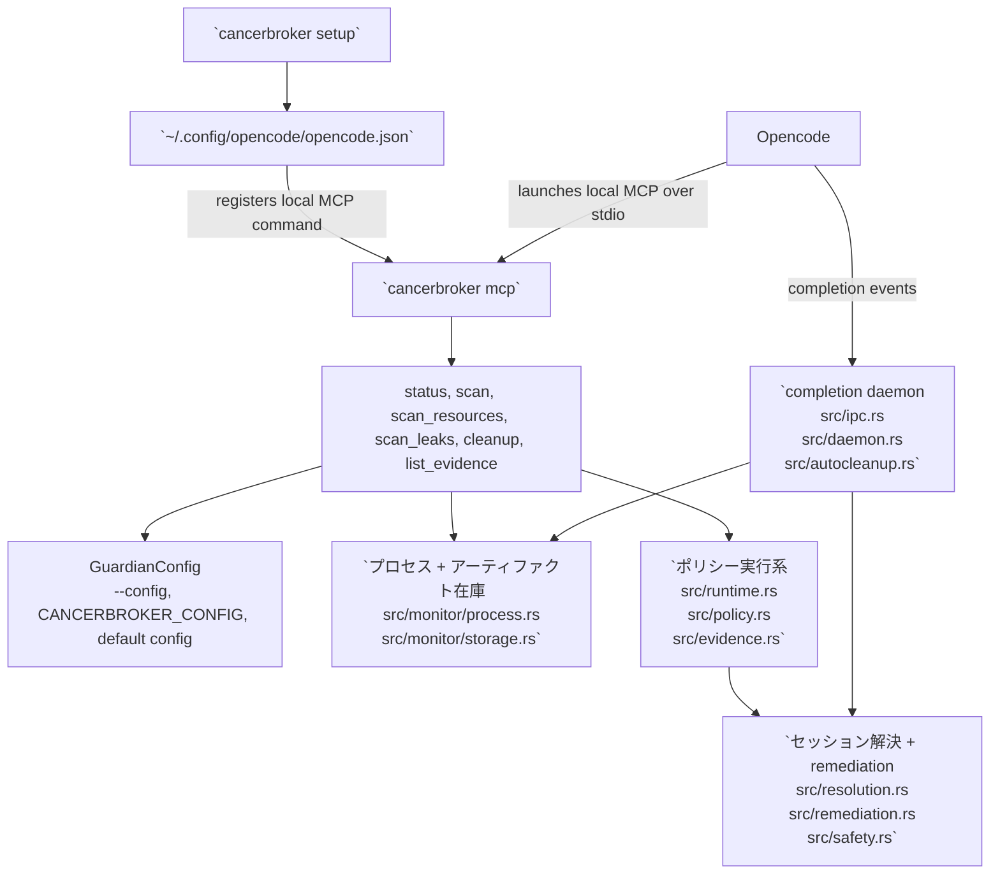

# 日本語

- [ホームに戻る](../README.md)
- [言語インデックス](index.md)

言語: [English](english.md) | [中文](chinese.md) | [Español](spanish.md) | [한국어](korean.md) | [日本語](japanese.md)

CancerBroker は Opencode プロセス向けの Rust 製クリーンアップツールです。PID、PGID、リッスンポート、詳細なオープンリソースを追跡し、繰り返される RSS 増加を検出して、シグナル送信前に安全チェックを行いながらタスク単位のプロセスを整理します。

## インストール

GitHub からインストール:

```bash
cargo install --git https://github.com/Topabaem05/CancerBroker.git
```

現在の checkout から直接ビルドして入れる場合:

```bash
cargo install --path .
```

バイナリが使えることを確認:

```bash
cancerbroker --help
```

## Opencode セットアップ

```bash
cancerbroker setup
```

このコマンドは TTY 上で対話型のターミナル setup wizard を開き、その後で次の処理を行います。

- `cancerbroker mcp` を使って CancerBroker をローカル Opencode MCP サーバーとして登録する
- rust-analyzer メモリガード設定を `~/.config/cancerbroker/config.toml` に書き込む
- ターミナル UI の初期化に失敗した場合は line-based wizard にフォールバックする

プロンプトなしでマシン推奨の既定値を使いたい場合は、非対話モードを使います。

```bash
cancerbroker setup --non-interactive
```

### setup が書き込む内容

`cancerbroker setup` は次のファイルを更新します。

- Opencode MCP 設定: `~/.config/opencode/opencode.json`
- CancerBroker guard 設定: `~/.config/cancerbroker/config.toml`

guard 設定の場所を上書きしたい場合は、実行前に `CANCERBROKER_CONFIG` を設定します。

```bash
export CANCERBROKER_CONFIG="$HOME/.config/cancerbroker/custom-config.toml"
cancerbroker setup --non-interactive
```

setup コマンドは、実際に更新したパスと作成したバックアップパスを表示します。

### 手動設定フロー

対話ウィザードを使わない最小フローは次の通りです。

1. バイナリをインストール
2. `cancerbroker setup --non-interactive` を実行
3. `~/.config/opencode/opencode.json` を確認
4. `~/.config/cancerbroker/config.toml` を確認
5. `cancerbroker --config ~/.config/cancerbroker/config.toml status --json` で検証

Opencode MCP エントリを再び削除する場合:

```bash
cancerbroker setup --uninstall --non-interactive
```

### 対話セットアップ例

コマンド例:

```bash
cancerbroker setup
```

代表的な wizard フロー:

```text
Header box: 検出した RAM、現在のステップ、setup 対象
Step box: タイトル、説明、入力、ヘルプ/検証パネル
Summary box: enabled 状態、memory cap、sample 数、startup grace、cooldown
Controls box: Enter で確定、Up で前へ、Left/Right/Space で enabled 切り替え、数字と Backspace で数値編集、Esc でキャンセル
Too-small box: ターミナルが小さすぎる場合の resize 案内
```

補足:

- 各プロンプトで `Enter` を押すと既定値をそのまま採用して次に進みます。
- メモリ入力は整数の `GB` ですが、guardian config には bytes で保存されます。
- setup を再実行すると、既存の guardian 設定が次回の wizard 既定値として再利用されます。
- setup wizard はグローバルな `mode` を変更しません。guardian config がまだ `observe` の場合、rust-analyzer guard は候補を記録するだけでプロセスは終了しません。

## Opencode での動作



- `cancerbroker setup` は `~/.config/opencode/opencode.json` を更新し、Opencode が `cancerbroker mcp` をローカル MCP サーバーとして起動できるようにします。
- `cancerbroker mcp` は `src/mcp.rs` から MCP ツールを提供します。`status`、`scan`、`scan_resources`、`scan_leaks`、`cleanup`、`list_evidence` が Opencode 向けの入口です。
- `cleanup` と `run-once` は同じポリシーパスを共有します: `src/cli.rs` -> `src/runtime.rs` -> `src/policy.rs` -> `src/evidence.rs`。
- `daemon` は長時間稼働するクリーンアップ経路です: `src/cli.rs` -> `src/daemon.rs` -> `src/ipc.rs` -> `src/autocleanup.rs` -> `src/resolution.rs` / `src/remediation.rs`。
- プロセスとアーティファクトのクリーンアップは、`src/config.rs` と `src/safety.rs` の `required_command_markers` と same-UID 安全チェックにより、Opencode/OpenAgent ワークロードに限定されます。

## クイックスタート

```bash
cancerbroker --config fixtures/config/observe-only.toml status --json
cancerbroker --config fixtures/config/observe-only.toml run-once --json
cancerbroker --config fixtures/config/completion-cleanup.toml daemon --json --max-events 128
cancerbroker --config fixtures/config/rust-analyzer-guard-minimal.toml ra-guard --json
scripts/measure_ra_guard_rss.sh --mode baseline-idle --output /tmp/ra-guard-rss-baseline.txt
```

ローカルインストール時の一般的な検証手順は次の通りです。

```bash
cancerbroker setup --non-interactive
cancerbroker --config ~/.config/cancerbroker/config.toml status --json
cancerbroker --config ~/.config/cancerbroker/config.toml ra-guard --json
```

## できること

- PID、親 PID、PGID、UID、メモリ、CPU、リッスンポートを含むライブプロセス情報を追跡します。
- command marker による安全ルールで Opencode 関連プロセスとセッションアーティファクトを解決します。
- クリーンアップ前に詳細なオープンファイルとソケットエンドポイントを取得します。
- ライブ RSS リーク候補を検出し、daemon モードでクリーンアップを実行します。
- まず `SIGTERM` を送り、タイムアウトを無視した場合は `SIGKILL` にエスカレーションします。

## Orphan Cleanup

CancerBroker は CLI から `opencode` の orphan cleanup も実行できます。

```bash
cancerbroker orphans --json        # dry run / 一致候補を表示
cancerbroker orphans --kill        # 一致した orphan process をすべて終了
cancerbroker orphans --kill --json
cancerbroker orphans watch         # 繰り返しスキャン結果を表示
cancerbroker orphans guard         # 繰り返しスキャン + threshold 超過時に終了
cancerbroker orphans guard --threshold-mb 512 --interval-secs 30
```

### Detection Model

- Unix 系では、CancerBroker は live process inventory と `ps -axo pid=,tty=` の結果を組み合わせて使います。
- 次の条件をすべて満たす場合にのみ orphan candidate とみなされます。
  - TTY が `?` または `??`
  - executable token または basename が `opencode` などの許可された command marker と完全一致する
  - 他の remediation 経路と同じ UID / command-marker safety check を通過する
- CancerBroker は、ファイルパスに `opencode` が含まれているだけの任意コマンドには一致させません。
- 非 Unix プラットフォームでは正確な TTY ヒューリスティックが使えないため、安全でない近似ではなく安全な degrade を選びます。

### Output Model

- デフォルト呼び出しは dry run です。
- orphaned process が見つからない場合、人向け出力は `✅ 깨끗합니다!` を表示します。
- JSON 出力には次が含まれます。
  - `matched_count`
  - `terminated_count`
  - `rejected_count`
  - `estimated_freed_bytes`
  - 各 process の `pid`, `parent_pid`, `pgid`, `memory_bytes`, `cpu_percent_milli`, `tty`, 完全な `command`

### Guard Behavior

- `watch` はスキャンを繰り返し、各 cycle の結果を表示します。
- `guard` は RSS threshold を超えた orphan candidate のみ remediation します。
- `--kill` は通常の remediation semantics を使います。
- `--kill --force` または `guard --force` は一致した orphan process に direct force remediation を使います。

## 検証

```bash
cargo fmt --all -- --check
cargo clippy --workspace --all-targets --all-features -- -D warnings
cargo test --workspace
cargo build --workspace
```

## サンドボックス終了検証

leak-enforcement の PID kill 経路に絞ったテスト:

```bash
cargo test --workspace run_leak_enforcement_with_inventory_terminates_leaking_process_in_enforce_mode -- --nocapture
```

サンドボックス検証で期待されるシグナル結果:

```json
{"returncode": -15, "signal": 15}
{"returncode": -9, "signal": 9}
```

- `signal: 15` は対象が `SIGTERM` 後に終了したことを意味します。
- `signal: 9` は対象が `SIGTERM` を無視し、CancerBroker が `SIGKILL` へエスカレーションしたことを意味します。
