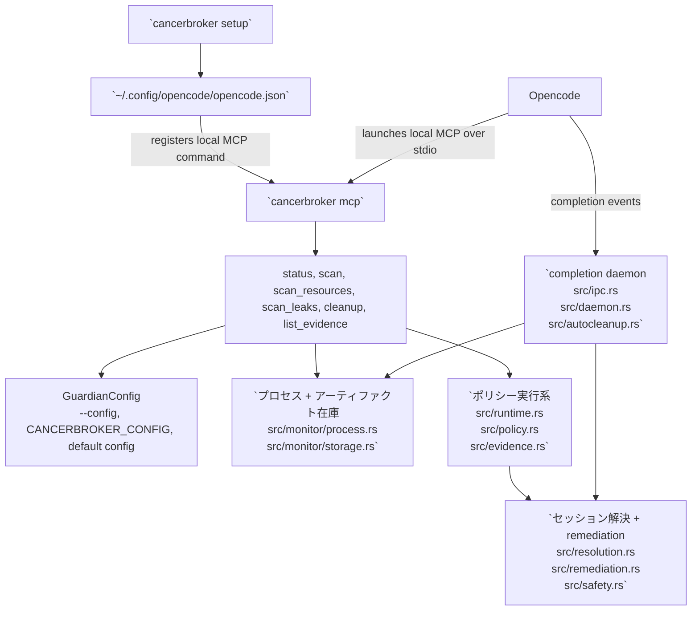

# 日本語

- [ホームに戻る](../README.md)
- [言語インデックス](index.md)

言語: [English](english.md) | [中文](chinese.md) | [Español](spanish.md) | [한국어](korean.md) | [日本語](japanese.md)

CancerBroker は Opencode プロセス向けの Rust 製クリーンアップツールです。PID、PGID、リッスンポート、詳細なオープンリソースを追跡し、繰り返される RSS 増加を検出して、シグナル送信前に安全チェックを行いながらタスク単位のプロセスを整理します。

## インストール

```bash
cargo install --git https://github.com/Topabaem05/CancerBroker.git
```

## Opencode セットアップ

```bash
cancerbroker setup
```

このコマンドは TTY 上で最小構成の line-based setup wizard を開き、その後で次の処理を行います。

- `cancerbroker mcp` を使って CancerBroker をローカル Opencode MCP サーバーとして登録する
- rust-analyzer メモリガード設定を `~/.config/cancerbroker/config.toml` に書き込む

プロンプトなしでマシン推奨の既定値を使いたい場合は、非対話モードを使います。

```bash
cancerbroker setup --non-interactive
```

### 対話セットアップ例

コマンド例:

```bash
cancerbroker setup
```

入力フロー例:

```text
CancerBroker setup will:
- register the local MCP server in OpenCode
- configure the rust-analyzer memory guard for this machine
Detected system RAM: 36 GB. Press Enter to accept the default shown in brackets.

Enable rust-analyzer memory protection? [Y/n]
  When enabled, CancerBroker watches rust-analyzer memory and can clean it up after repeated over-limit samples.
>

Memory cap in GB [6]
  CancerBroker starts counting rust-analyzer as over the limit after it stays above this amount of RAM.
>

Consecutive over-limit samples before action [3]
  This avoids reacting to a single short memory spike.
>

Startup grace in seconds [300]
  rust-analyzer often spikes during initial indexing, so counting starts after this delay.
>

Cooldown after remediation in seconds [1800]
  This prevents repeated remediation loops after rust-analyzer restarts.
>
```

補足:

- 各プロンプトで `Enter` を押すと既定値をそのまま採用して次に進みます。
- メモリ入力は整数の `GB` ですが、guardian config には bytes で保存されます。
- setup を再実行すると、既存の guardian 設定が次回の wizard 既定値として再利用されます。
- setup wizard はグローバルな `mode` を変更しません。guardian config がまだ `observe` の場合、rust-analyzer guard は候補を記録するだけでプロセスは終了しません。

## Opencode での動作



- `cancerbroker setup` は `~/.config/opencode/opencode.json` を更新し、Opencode が `cancerbroker mcp` をローカル MCP サーバーとして起動できるようにします。
- `cancerbroker mcp` は `src/mcp.rs` から MCP ツールを提供します。`status`、`scan`、`scan_resources`、`scan_leaks`、`cleanup`、`list_evidence` が Opencode 向けの入口です。
- `cleanup` と `run-once` は同じポリシーパスを共有します: `src/cli.rs` -> `src/runtime.rs` -> `src/policy.rs` -> `src/evidence.rs`。
- `daemon` は長時間稼働するクリーンアップ経路です: `src/cli.rs` -> `src/daemon.rs` -> `src/ipc.rs` -> `src/autocleanup.rs` -> `src/resolution.rs` / `src/remediation.rs`。
- プロセスとアーティファクトのクリーンアップは、`src/config.rs` と `src/safety.rs` の `required_command_markers` と same-UID 安全チェックにより、Opencode/OpenAgent ワークロードに限定されます。

## クイックスタート

```bash
cancerbroker --config fixtures/config/observe-only.toml status --json
cancerbroker --config fixtures/config/observe-only.toml run-once --json
cancerbroker --config fixtures/config/completion-cleanup.toml daemon --json --max-events 128
```

## できること

- PID、親 PID、PGID、UID、メモリ、CPU、リッスンポートを含むライブプロセス情報を追跡します。
- command marker による安全ルールで Opencode 関連プロセスとセッションアーティファクトを解決します。
- クリーンアップ前に詳細なオープンファイルとソケットエンドポイントを取得します。
- ライブ RSS リーク候補を検出し、daemon モードでクリーンアップを実行します。
- まず `SIGTERM` を送り、タイムアウトを無視した場合は `SIGKILL` にエスカレーションします。

## 検証

```bash
cargo fmt --all -- --check
cargo clippy --workspace --all-targets --all-features -- -D warnings
cargo test --workspace
cargo build --workspace
```

## サンドボックス終了検証

leak-enforcement の PID kill 経路に絞ったテスト:

```bash
cargo test --workspace run_leak_enforcement_with_inventory_terminates_leaking_process_in_enforce_mode -- --nocapture
```

サンドボックス検証で期待されるシグナル結果:

```json
{"returncode": -15, "signal": 15}
{"returncode": -9, "signal": 9}
```

- `signal: 15` は対象が `SIGTERM` 後に終了したことを意味します。
- `signal: 9` は対象が `SIGTERM` を無視し、CancerBroker が `SIGKILL` へエスカレーションしたことを意味します。
