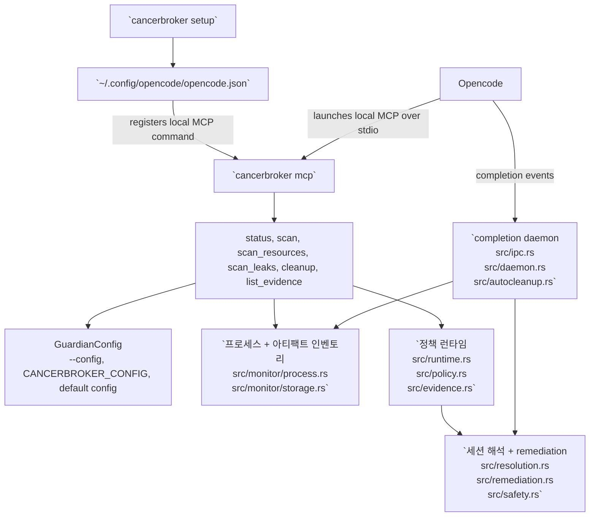

# 한국어

- [메인으로 돌아가기](../README.md)
- [언어 인덱스](index.md)

언어: [English](english.md) | [中文](chinese.md) | [Español](spanish.md) | [한국어](korean.md) | [日本語](japanese.md)

CancerBroker는 Opencode 프로세스를 정리하는 Rust 기반 도구입니다. PID, PGID, 리스닝 포트, 상세 오픈 리소스를 추적하고, 반복적인 RSS 증가를 감지하며, 시그널을 보내기 전에 안전 검사를 거쳐 작업 범위의 프로세스를 정리합니다.

## 설치

```bash
cargo install --git https://github.com/Topabaem05/CancerBroker.git
```

## Opencode 설정

```bash
cancerbroker setup
```

이제 이 명령은 TTY에서 최소한의 line-based setup wizard를 실행한 뒤 다음을 수행합니다.

- `cancerbroker mcp`를 사용해 CancerBroker를 로컬 Opencode MCP 서버로 등록
- rust-analyzer 메모리 가드 설정을 `~/.config/cancerbroker/config.toml`에 기록

프롬프트 없이 현재 머신에 맞는 권장 기본값만 적용하려면 non-interactive 모드를 사용합니다.

```bash
cancerbroker setup --non-interactive
```

### 인터랙티브 설정 예시

예시 명령:

```bash
cancerbroker setup
```

예시 입력 흐름:

```text
CancerBroker setup will:
- register the local MCP server in OpenCode
- configure the rust-analyzer memory guard for this machine
Detected system RAM: 36 GB. Press Enter to accept the default shown in brackets.

Enable rust-analyzer memory protection? [Y/n]
  When enabled, CancerBroker watches rust-analyzer memory and can clean it up after repeated over-limit samples.
>

Memory cap in GB [6]
  CancerBroker starts counting rust-analyzer as over the limit after it stays above this amount of RAM.
>

Consecutive over-limit samples before action [3]
  This avoids reacting to a single short memory spike.
>

Startup grace in seconds [300]
  rust-analyzer often spikes during initial indexing, so counting starts after this delay.
>

Cooldown after remediation in seconds [1800]
  This prevents repeated remediation loops after rust-analyzer restarts.
>
```

참고:

- 각 프롬프트에서 `Enter`를 누르면 기본값을 그대로 사용하고 다음 단계로 진행합니다.
- 메모리 입력은 정수 `GB` 단위로 받지만, guardian config에는 bytes로 저장됩니다.
- setup을 다시 실행하면 기존 guardian 설정이 다음 wizard 기본값으로 재사용됩니다.
- setup wizard는 전역 `mode`를 바꾸지 않습니다. guardian config가 여전히 `observe`이면 rust-analyzer guard는 후보만 기록하고 프로세스를 종료하지 않습니다.

## Opencode에서 동작하는 방식



- `cancerbroker setup`은 `~/.config/opencode/opencode.json`을 갱신해서 Opencode가 `cancerbroker mcp`를 로컬 MCP 서버로 실행할 수 있게 합니다.
- `cancerbroker mcp`는 `src/mcp.rs`에서 MCP 도구를 제공합니다. `status`, `scan`, `scan_resources`, `scan_leaks`, `cleanup`, `list_evidence`가 Opencode 측 진입점입니다.
- `cleanup`과 `run-once`는 같은 정책 경로를 공유합니다: `src/cli.rs` -> `src/runtime.rs` -> `src/policy.rs` -> `src/evidence.rs`.
- `daemon`은 장기 실행 정리 경로입니다: `src/cli.rs` -> `src/daemon.rs` -> `src/ipc.rs` -> `src/autocleanup.rs` -> `src/resolution.rs` / `src/remediation.rs`.
- 프로세스와 아티팩트 정리는 `src/config.rs`와 `src/safety.rs`의 `required_command_markers` 및 same-UID 안전 검사로 Opencode/OpenAgent 워크로드 범위 안에 제한됩니다.

## 빠른 시작

```bash
cancerbroker --config fixtures/config/observe-only.toml status --json
cancerbroker --config fixtures/config/observe-only.toml run-once --json
cancerbroker --config fixtures/config/completion-cleanup.toml daemon --json --max-events 128
```

## 하는 일

- PID, 부모 PID, PGID, UID, 메모리, CPU, 리스닝 포트를 포함한 실시간 프로세스 식별 정보를 추적합니다.
- command-marker 안전 규칙으로 Opencode 관련 프로세스와 세션 아티팩트를 해석합니다.
- 정리 전에 상세한 오픈 파일과 소켓 엔드포인트를 수집합니다.
- 실시간 RSS leak candidate를 감지하고 daemon 모드에서 정리를 수행합니다.
- 먼저 `SIGTERM`을 보내고, 타임아웃을 무시하면 `SIGKILL`로 escalation 합니다.

## 검증

```bash
cargo fmt --all -- --check
cargo clippy --workspace --all-targets --all-features -- -D warnings
cargo test --workspace
cargo build --workspace
```

## 샌드박스 종료 검증

leak-enforcement PID kill 경로만 집중적으로 보는 테스트:

```bash
cargo test --workspace run_leak_enforcement_with_inventory_terminates_leaking_process_in_enforce_mode -- --nocapture
```

샌드박스 검증에서 기대되는 시그널 결과:

```json
{"returncode": -15, "signal": 15}
{"returncode": -9, "signal": 9}
```

- `signal: 15`는 대상이 `SIGTERM` 후 종료됐음을 의미합니다.
- `signal: 9`는 대상이 `SIGTERM`을 무시해서 CancerBroker가 `SIGKILL`로 escalation 했음을 의미합니다.
