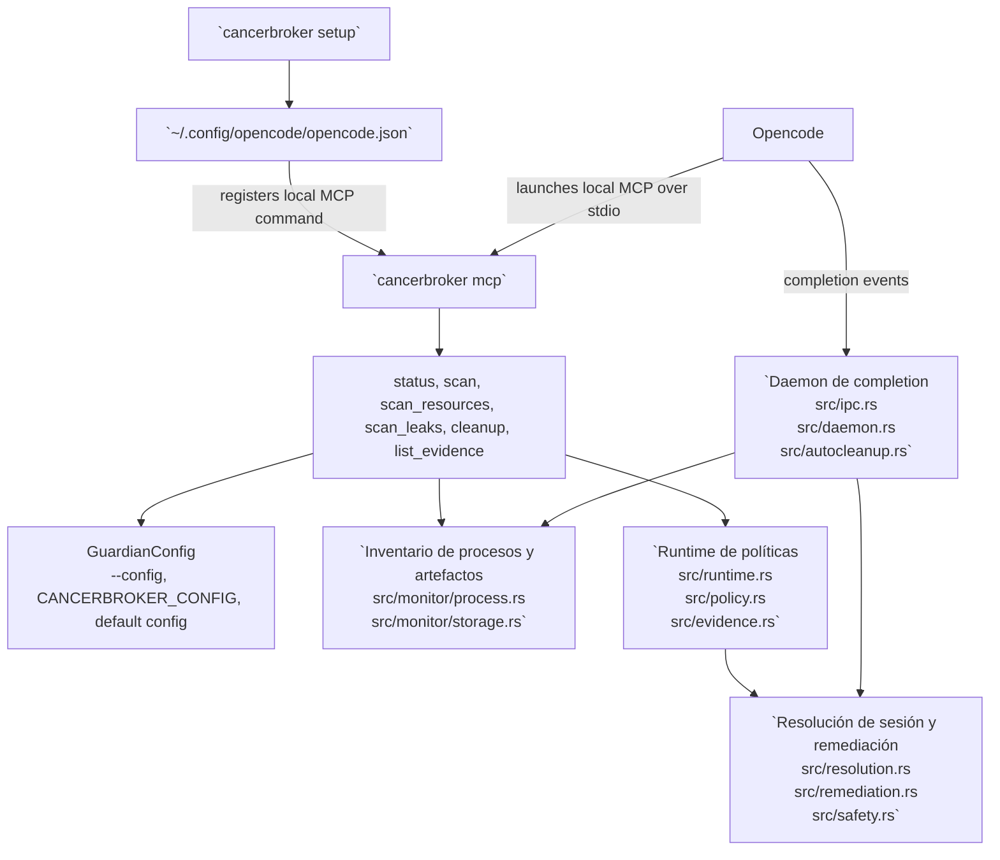

# Español

- [Volver al inicio](../README.md)
- [Índice de idiomas](index.md)

Idiomas: [English](english.md) | [中文](chinese.md) | [Español](spanish.md) | [한국어](korean.md) | [日本語](japanese.md)

CancerBroker es una herramienta de limpieza en Rust para procesos de Opencode. Rastrea PID, PGID, puertos en escucha y recursos abiertos detallados, detecta crecimiento repetido de RSS y limpia procesos dentro del alcance de la tarea con comprobaciones de seguridad antes de enviar señales.

## Instalación

```bash
cargo install --git https://github.com/Topabaem05/CancerBroker.git
```

## Configuración de Opencode

```bash
cancerbroker setup
```

Ahora este comando abre un asistente interactivo mínimo en TTY y luego:

- registra CancerBroker como un servidor MCP local de Opencode mediante `cancerbroker mcp`
- escribe valores predeterminados de rust-analyzer de bajo consumo en `~/.config/opencode/opencode.json`
- escribe la configuración del guard de memoria de rust-analyzer en `~/.config/cancerbroker/config.toml`

Usa el modo no interactivo cuando quieras aplicar los valores recomendados para la máquina sin preguntas:

```bash
cancerbroker setup --non-interactive
```

### Ejemplo de configuración interactiva

Comando de ejemplo:

```bash
cancerbroker setup
```

Ejemplo del flujo de entrada:

```text
CancerBroker setup will:
- register the local MCP server in OpenCode
- apply low-memory rust-analyzer LSP defaults
- configure the rust-analyzer memory guard for this machine
Detected system RAM: 36 GB. Press Enter to accept the default shown in brackets.

Enable rust-analyzer memory protection? [Y/n]
  When enabled, CancerBroker watches rust-analyzer memory and can clean it up after repeated over-limit samples.
>

Memory cap in GB [6]
  CancerBroker starts counting rust-analyzer as over the limit after it stays above this amount of RAM.
>

Consecutive over-limit samples before action [3]
  This avoids reacting to a single short memory spike.
>

Startup grace in seconds [300]
  rust-analyzer often spikes during initial indexing, so counting starts after this delay.
>

Cooldown after remediation in seconds [1800]
  This prevents repeated remediation loops after rust-analyzer restarts.
>
```

Notas:

- Pulsa `Enter` en cualquier pregunta para aceptar el valor predeterminado y continuar.
- La memoria se introduce como un número entero en `GB`, pero se guarda internamente en bytes dentro de la configuración guardian.
- Si vuelves a ejecutar setup, la configuración guardian existente se reutiliza como valor predeterminado.
- El asistente no cambia el `mode` global; si tu configuración guardian sigue en `observe`, el guard de rust-analyzer registrará candidatos pero no terminará procesos.

## Cómo funciona en Opencode



- `cancerbroker setup` actualiza `~/.config/opencode/opencode.json` para que Opencode pueda iniciar `cancerbroker mcp` como servidor MCP local.
- `cancerbroker mcp` sirve las herramientas MCP desde `src/mcp.rs`; `status`, `scan`, `scan_resources`, `scan_leaks`, `cleanup` y `list_evidence` son los puntos de entrada orientados a Opencode.
- `cleanup` y `run-once` comparten la misma ruta de políticas: `src/cli.rs` -> `src/runtime.rs` -> `src/policy.rs` -> `src/evidence.rs`.
- `daemon` es la ruta de limpieza de larga duración: `src/cli.rs` -> `src/daemon.rs` -> `src/ipc.rs` -> `src/autocleanup.rs` -> `src/resolution.rs` / `src/remediation.rs`.
- La limpieza de procesos y artefactos se limita a cargas de trabajo de Opencode/OpenAgent mediante `required_command_markers` y comprobaciones de seguridad por mismo UID en `src/config.rs` y `src/safety.rs`.

## Inicio rápido

```bash
cancerbroker --config fixtures/config/observe-only.toml status --json
cancerbroker --config fixtures/config/observe-only.toml run-once --json
cancerbroker --config fixtures/config/completion-cleanup.toml daemon --json --max-events 128
```

## Qué hace

- Rastrea la identidad del proceso en vivo con PID, PID padre, PGID, UID, memoria, CPU y puertos en escucha.
- Resuelve procesos relacionados con Opencode y artefactos de sesión mediante reglas de seguridad basadas en command markers.
- Captura archivos abiertos detallados y endpoints de sockets antes de la limpieza.
- Detecta candidatos de fuga de RSS en vivo y aplica limpieza en modo daemon.
- Termina objetivos con `SIGTERM` primero y luego escala a `SIGKILL` si ignoran el tiempo de espera.

## Verificación

```bash
cargo fmt --all -- --check
cargo clippy --workspace --all-targets --all-features -- -D warnings
cargo test --workspace
cargo build --workspace
```

## Prueba de terminación en sandbox

Prueba enfocada para la ruta de terminación de PID en leak enforcement:

```bash
cargo test --workspace run_leak_enforcement_with_inventory_terminates_leaking_process_in_enforce_mode -- --nocapture
```

Resultados de señal esperados en la verificación del sandbox:

```json
{"returncode": -15, "signal": 15}
{"returncode": -9, "signal": 9}
```

- `signal: 15` significa que el objetivo salió después de `SIGTERM`.
- `signal: 9` significa que el objetivo ignoró `SIGTERM` y CancerBroker escaló a `SIGKILL`.
